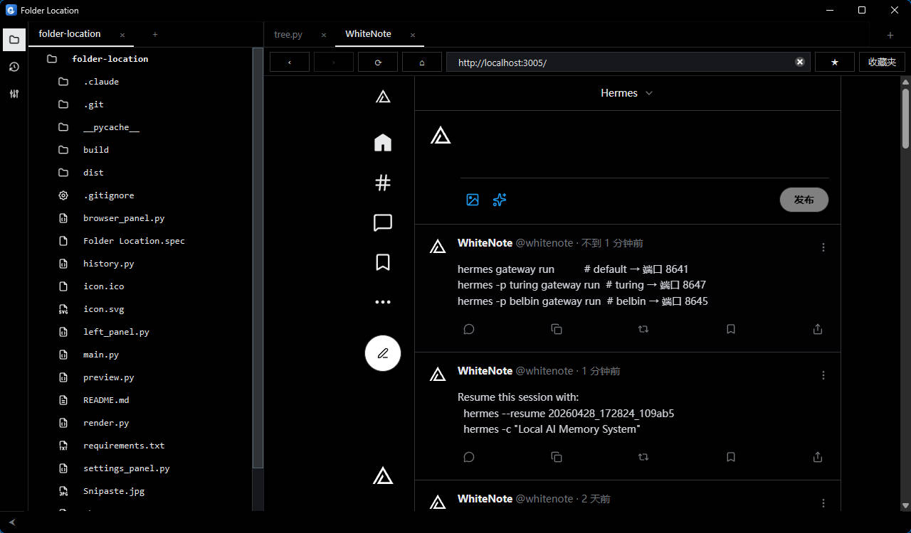

# Folder Location

左侧多标签页文件夹浏览 + 右侧文件内容预览工具。

## 功能

- **多文件夹标签页**：类似 Chrome，可同时打开任意数量的文件夹，支持拖动排序和横向滚动
- **懒加载树状图**：展开时才读取子目录，无论多复杂的目录结构都能瞬间加载
- **自动发现文件变化**：已打开/已展开的目录支持新增、删除、重命名、内容修改自动检测，左侧树状图和右侧预览会自动刷新
- **文件更改历史**：自动记录文件的新增、删除、修改事件，按时间排列，支持点击预览和复制路径
- **侧边栏切换**：左侧面板可通过 `Ctrl+B` 折叠/展开，底部状态栏提供快捷切换按钮
- **复制路径**：鼠标悬停任意文件/文件夹，点击「复制路径」复制路径，复制成功后按钮短暂显示 `OK`。可在设置中自定义 `@` 前缀和路径分隔符（`/` 或 `\`）
- **在资源管理器中打开**：鼠标悬停文件/文件夹，点击「Open」在 Windows 资源管理器中定位
- **预览区右键复制**：选中文本后右键可选择 `Copy Path` 或 `Copy`
  - `Copy Path`：复制路径（含行号）加选中文本代码块，路径格式遵循设置
  - `Copy`：只复制选中文本；`Ctrl+C` 也保持只复制文本
- **代码块复制**：Markdown 和代码高亮预览中的代码块悬停显示 `Copy` 按钮，复制成功后按钮短暂显示 `OK`
- **文件预览**：
  - `.md` / `.mdx` — Markdown 渲染（含表格、围栏代码块）
  - `.py` `.ts` `.tsx` `.js` `.json` `.c` `.h` `.go` `.rs` 等 — 语法高亮（GitHub Dark 主题）
  - 图片（`.png` `.jpg` `.gif` `.svg` `.webp`）— 直接显示
  - 其他文本文件 — 等宽字体纯文本显示
- **内置浏览器**：右侧预览区可打开浏览器标签，支持网址输入、搜索、返回、前进、刷新/停止、主页、收藏、收藏夹、弹窗新标签和登录状态保存
- **会话恢复**：打开的文件夹、预览文件、浏览器标签、浏览器收藏和网站登录状态会在下次启动时恢复
- **设置面板**：左侧侧边栏点击齿轮图标可打开设置，支持自定义复制路径的 `@` 前缀开关和路径分隔符（`/` 或 `\`），实时预览效果，设置自动持久化
- **SVG 图标系统**：使用 pytablericons 渲染黑白 SVG 图标，文件树、历史面板和侧边栏均使用统一图标风格
- **复古滚动条**：标签页和内容区使用 16px 复古 Windows 长方形滚动条，预览区 WebKit 滚动条风格统一
- **Windows 深色标题栏**：在 Windows 10/11 下使用 DWM 深色标题栏，并在窗口显示、激活和托盘恢复时重新应用
- **系统托盘**：关闭窗口时最小化到托盘，单击托盘图标切换显示/隐藏，右键可退出

## 项目结构

```
main.py             # 入口 + MainWindow
left_panel.py       # 左侧侧边栏（图标条 + 文件树/历史/设置切换）
tree.py             # 文件树 + 文件夹标签页
history.py          # 文件更改历史面板
settings_panel.py   # 设置面板（复制路径格式）
preview.py          # 右侧预览区（标签页 + 浏览器 + 搜索）
browser_panel.py    # 内置浏览器面板
render.py           # 文件预览 HTML 渲染（Markdown / 代码高亮 / 图片）
theme.py            # 主题、样式表、图标加载、Windows 深色标题栏
```

## 环境要求

- Python 3.12+（conda）
- Qt WebEngine（随 `PySide6` 安装，用于文件预览和内置浏览器）
- 见 `requirements.txt`

## 安装

```powershell
conda create -n foldertree python=3.12 -y
conda activate foldertree
pip install -r requirements.txt
```

## 运行

```powershell
python main.py
```

## 使用方法

| 操作 | 方式 |
|------|------|
| 添加文件夹 | 点击左上角 **+** 按钮，或按 `Ctrl+O` |
| 切换文件夹 | 点击顶部标签页，或横向滚动查看更多标签 |
| 关闭当前标签页 | 点击标签页上的 **×**，或按 `Ctrl+W` |
| 拖动排序 | 拖拽标签页左右移动 |
| 折叠/展开左面板 | 按 `Ctrl+B`，或点击底部状态栏左侧按钮 |
| 切换文件树/历史/设置 | 点击左侧图标条中的文件夹、历史或齿轮图标 |
| 展开目录 | 点击树状图中的箭头 |
| 预览文件 | 点击任意文件，右侧显示内容 |
| 在资源管理器中打开 | 鼠标悬停文件/文件夹，点击「Open」 |
| 打开浏览器 | 点击右侧预览区顶部的 **+** 按钮 |
| 输入网址/搜索 | 在浏览器地址栏输入网址或关键词后按 `Enter` |
| 聚焦地址栏 | 在浏览器标签中按 `Ctrl+L` |
| 浏览器导航 | 点击浏览器工具栏中的返回、前进、刷新/停止、主页按钮 |
| 收藏网页 | 点击浏览器工具栏中的 **☆**，再次点击 **★** 可取消收藏 |
| 打开收藏夹 | 点击浏览器工具栏中的「收藏夹」 |
| 浏览器弹窗 | 网页打开新窗口时会自动创建新的浏览器标签 |
| 复制路径 | 鼠标悬停到文件/文件夹，点击「复制路径」 |
| 自定义复制格式 | 点击左侧齿轮图标打开设置，切换 `@` 前缀和路径分隔符 |
| 复制代码块 | 在 Markdown/代码预览中悬停代码块，点击 `Copy` |
| 复制预览选区路径 | 在右侧预览区选中文本后右键点击 `Copy Path` |
| 搜索预览内容 | 在右侧预览区按 `Ctrl+F` 打开搜索栏，`Enter` / `Shift+Enter` 跳转，`Esc` 关闭 |
| 复制预览选区文本 | 在右侧预览区选中文本后右键点击 `Copy`，或按 `Ctrl+C` |

## 打包为 exe

确保在 conda 环境中已安装依赖：

```powershell
conda activate foldertree
```

### 单文件夹模式（推荐，启动快）

```powershell
pyinstaller --noconsole --name "Folder Location" --icon icon.ico --add-data "icon.svg:." main.py
```

生成目录：`dist\Folder Location\Folder Location.exe`

### 单文件模式

```powershell
pyinstaller --noconsole --onefile --name "Folder Location" --icon icon.ico --add-data "icon.svg:." main.py
```

生成文件：`dist\Folder Location.exe`

> **注意：**
> - `--icon icon.ico` 设置 Windows exe 文件图标
> - `--add-data "icon.svg:."` 将运行时使用的 SVG 图标文件打包进去
> - 使用了 `QWebEngineView`，单文件夹模式的 `dist` 目录约 150–300 MB，属正常现象
> - 单文件模式首次启动需要解压，速度较慢

### 清理打包缓存

```powershell
Remove-Item -Recurse -Force build, dist, *.spec
```
